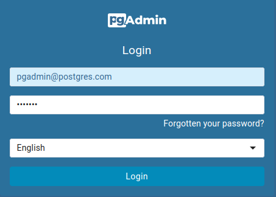
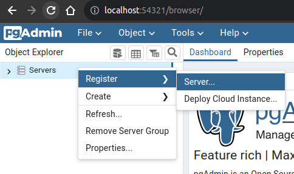
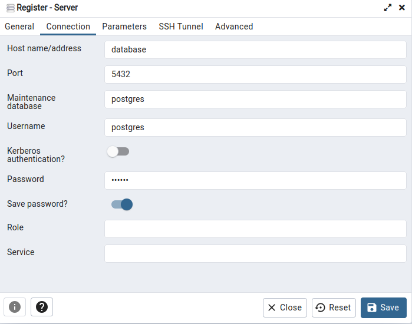
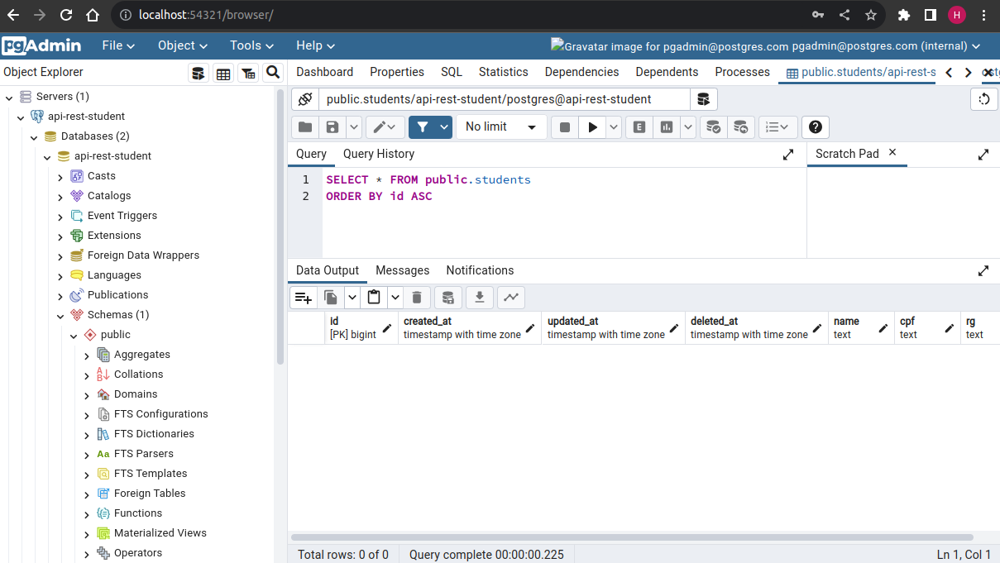
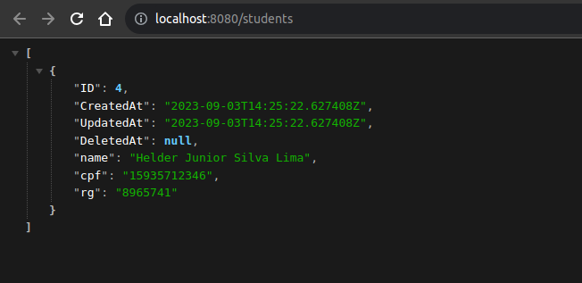
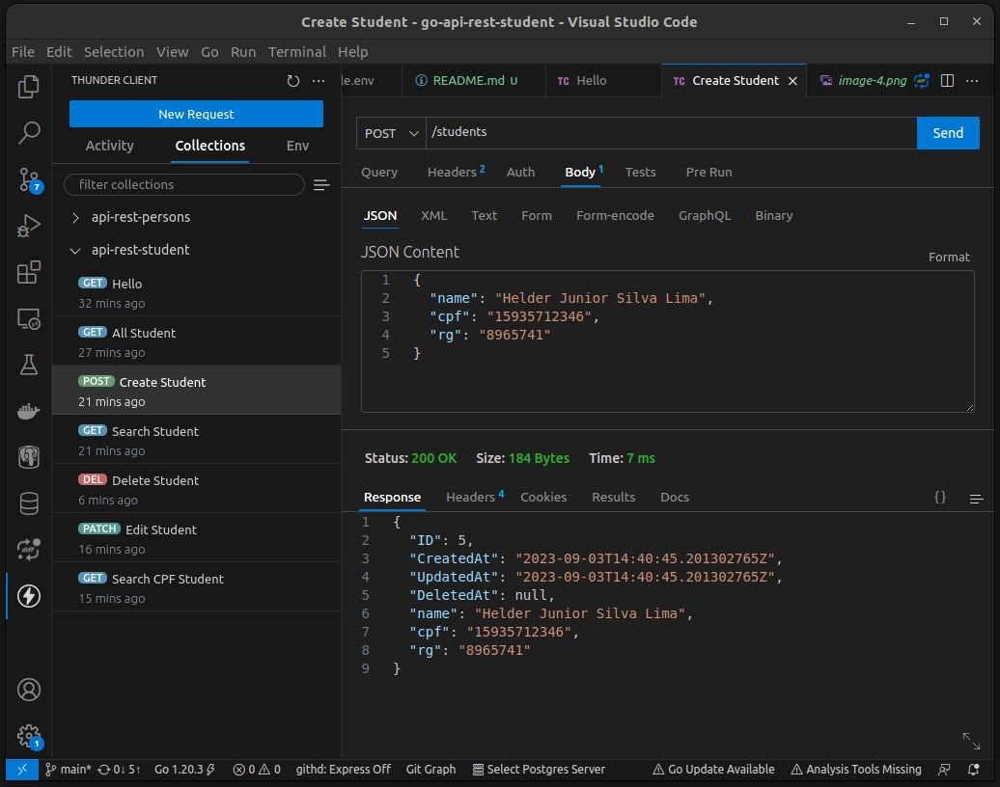

# Initializing the Project

Before starting the project, ensure that the required ports are available. Use the following commands to check:

```bash
sudo lsof -i :5432  # Check if the default PostgreSQL database port is in use
sudo lsof -i :54321 # Check if the port for the pgadmin web is in use
sudo lsof -i :8080  # Check if the port for the our Golang app is in use
```

The command output will resemble:

```bash
COMMAND   PID     USER   FD  TYPE DEVICE  SIZE NODE NAME
docker    104911  root   4u  IPv4 906734  t0   TCP  *:postgresql (LISTEN)
```

If any of the ports are occupied, you'll need to terminate the corresponding process. To do this, note the PID from the output and execute:

```bash
sudo kill <PID>
```

Once the ports are available, create a `.env` file in the root directory. Populate this file with the contents of `example.env`. The only variable you might want to change is `DB_PASSWORD`.

```
DB_USER=postgres
DB_NAME=api-rest-persons
DB_PASSWORD=123456
DB_HOST=database
DB_SSLMODE=disable

PGADMIN_EMAIL=pdadmin@postgres.com
PGADMIN_PASSWORD=pgadmin
```

With the environment set up, you can start the services using:

```bash
docker-compose up
```
# Using API

After executing the above command, you can access the pgadmin web application at:
[http://localhost:54321](http://localhost:54321)

- Login

    

    The password is `PGADMIN_PASSWORD`

- Register new database server

    

    

    The password is `DB_PASSWORD`

- Now you can see all data in database
    


- You can see too all the data access the endpoint:

    [http://localhost:8080/students](http://localhost:8080/students)
    

- You can explore all API endpoints with Thunder Client importing for you VSCode extension with the `thunder-collection_api-rest-persons.json` :
 [How to Import a Collection](https://github.com/rangav/thunder-client-support#how-to-import-a-collection)

    
